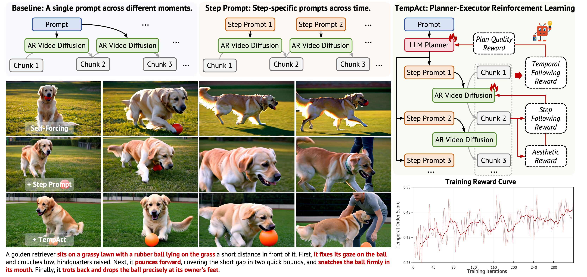

<h1 align="center">TempAct: Advancing Temporal Plausibility in Autoregressive Video Generation via Planner-Executor RL</h1>

<p align="center">
  <a href="https://jingw193.github.io/TempAct/"></a> &nbsp;
  <a href="https://arxiv.org/abs/2606.28016"></a> &nbsp;
  <a href="https://github.com/jingw193/TempAct"></a> &nbsp;
  <a href="https://huggingface.co/jing1119/TempAct"></a>
</p>

**Reinforcement learning for temporal-order fidelity in autoregressive video generation.**

TempAct fine-tunes streaming / causal video diffusion models so that the generated
video respects the **temporal order of actions** described in the prompt
(e.g. *"first pour the sauce, then add the cheese, then the pepperoni"*). It is a
**planner–executor RL framework** that jointly optimizes

- an **LLM planner** (a LoRA-tuned Qwen3 that decomposes the global instruction into span-aware step prompts), and
- an **AR diffusion executor** (the video generator that realizes each step under its own generated history),

trained against multimodal reward models (a Qwen3-VL video reward + an LLM judge
for action decomposition).

<p align="center">
  
</p>

> **Figure 1. Overview and Motivation of TempAct.** Single-prompt AR generation
> conditions every chunk on the same global instruction, while step-prompt
> generation provides explicit stage-wise conditions but still relies on a fixed
> executor. TempAct introduces a planner–executor RL framework that jointly
> optimizes temporal decomposition and prompt-transition execution, producing
> more faithful event progression under temporally complex instructions.

Two base video backbones are supported:

| Backbone | Pipeline | Training entry | Config |
|---|---|---|---|
| **Self-Forcing** | `self_forcing/causal_pipeline.py` | `scripts/train_flow_grpo_llm_diffusion_mix_acc.py` | `config/self_forcing.py:self_forcing_llm_diffusion_rl_mix` |
| **LongLive** | `self_forcing/interactive_causal_pipeline.py` | `scripts/train_longlive_flow_grpo_llm_diffusion_mix_acc.py` | `config/longlive.py:longlive_llm_diffusion_rl_mix` |

---

## Repository layout

```
config/                 ml_collections training configs (self_forcing.py, longlive.py, base.py)
flow_grpo/              RL machinery + reward models
  ├── rewards.py            reward registry / multi-reward aggregation
  ├── qwen3vl_video_reward.py   Qwen3-VL video reward (vLLM OpenAI client)
  ├── llm_judge_score.py        action-decomposition LLM judge reward
  ├── video_pickscore_scorer.py PickScore-based local reward
  ├── stat_tracking.py, ema.py, diffusers_patch/ ...
self_forcing/           video backbones (Wan2.1), causal pipelines, LLM policy
scripts/                training launchers + accelerate config
  ├── run_multi_node_vllm_reward.sh   multi-node launcher (entry point)
  ├── train_flow_grpo_llm_diffusion_mix_acc.py        (Self-Forcing)
  └── train_longlive_flow_grpo_llm_diffusion_mix_acc.py (LongLive)
tools/                  inference + evaluation
  ├── inference_unified.py        unified inference for both backbones
  ├── eval_qwen3*.py, eval_gemini*.py, metric/ ...
dataset/                temporal-order prompt sets (train / eval)
ckpt/                   released LoRA checkpoints (download from HuggingFace)
inference_scripts_self_forcing.sh / inference_scripts_longlive.sh   inference entry points
```

---

## Released checkpoints

All TempAct LoRA weights are released at
**[huggingface.co/jing1119/TempAct](https://huggingface.co/jing1119/TempAct)**.
Download them into a top-level `ckpt/` directory (the configs and inference
scripts reference these paths directly):

```bash
pip install -U "huggingface_hub[cli]"
huggingface-cli download jing1119/TempAct --local-dir ckpt
```

| Path | Role | Description |
|---|---|---|
| `ckpt/pre_llm_policy_lora/` | **Planner cold-start** | LLM planner LoRA cold-started on the plan format. Completes the planning task on its own — used as the baseline and as the warm-start for RL training. |
| `ckpt/self_forcing/` | **Self-Forcing Planner + Executor** | TempAct-finetuned weights for the Self-Forcing backbone. Contains `lora/` (diffusion executor) and `llm_lora/` (LLM planner). |
| `ckpt/longlive/` | **LongLive Planner + Executor** | TempAct-finetuned weights for the LongLive backbone. Contains `lora/` (diffusion executor) and `llm_lora/` (LLM planner). |

`ckpt/` is git-ignored — the weights live on HuggingFace, not in this repo.

---

## Environment setup

The RL machinery is based on the [Flow-GRPO](https://github.com/yifan123/flow_grpo)
codebase; the video backbones build on [Self-Forcing](https://github.com/guandeh17/Self-Forcing)
and [LongLive](https://huggingface.co/Efficient-Large-Model/LongLive-1.3B) (Wan2.1-T2V-1.3B).

The reference environment is **Python 3.12 + PyTorch 2.7.1 (CUDA 12.9)**;
`requirements.txt` is pinned to match it.

```bash
git clone https://github.com/jingw193/TempAct.git
cd TempAct

conda create -n tempact python=3.12 -y
conda activate tempact
# Install PyTorch first from the CUDA index (CPU wheels will not work for training):
pip install torch==2.7.1 torchvision==0.22.1 --index-url https://download.pytorch.org/whl/cu129
pip install -r requirements.txt
pip install -e .            # see setup.py / requirements.txt
```

> **FlashAttention & extras:** the reference environment ships prebuilt
> `flash_attn==2.8.1`. Install a wheel matching your CUDA/torch if you need it.
> Optional reward/eval backends (PaddleOCR, HPSv2, ImageReward, OpenCLIP,
> DeepSpeed, xDiT/`xfuser`) are commented out in `requirements.txt` — uncomment
> only the ones you use.

> **Paths:** The released TempAct LoRA checkpoints are referenced via the
> local `ckpt/` directory (see [Released checkpoints](#released-checkpoints)).
> Base-model paths (Self-Forcing / Wan2.1 / LongLive / Qwen3) still use
> `/path/to/...` placeholders in the configs and scripts — replace them with
> your local download paths, or set `ROOT_DIR` in the launcher script. No
> private absolute paths are committed.

### Model checkpoints to download

| Checkpoint | Used as | Source |
|---|---|---|
| Self-Forcing DMD (`self_forcing_dmd.pt`) | base generator | `gdhe17/Self-Forcing` |
| Wan2.1-T2V-1.3B | VAE / text encoder backbone | `Wan-AI/Wan2.1-T2V-1.3B` |
| LongLive-1.3B (`longlive_base.pt`, `lora.pt`) | LongLive backbone | `Efficient-Large-Model/LongLive-1.3B` |
| Qwen3-1.7B | LLM prompt-rewrite policy | `Qwen/Qwen3-1.7B` |

Point the corresponding `config.self_model_path` / `config.llm_model_path` /
`*.yaml` `generator_ckpt` fields at the downloaded paths.

---

## Reward servers (required for training)

Rewards are served over **OpenAI-compatible HTTP endpoints** (vLLM). Launch them
*before* training and expose their addresses via environment variables.

```bash
# Qwen3-VL video reward server (one per node)
vllm serve Qwen/Qwen3-VL-8B-Instruct \
    --host 0.0.0.0 --port 8000 \
    --tensor-parallel-size 1 --max-model-len 32768 \
    --limit-mm-per-prompt image=16 --trust-remote-code

# LLM judge server (action-decomposition reward)
vllm serve Qwen/Qwen3-8B --host 0.0.0.0 --port 7000
```

Environment variables read by the reward modules:

| Variable | Default | Consumed by |
|---|---|---|
| `VLLM_BASE_URL`, `VLLM_MODEL`, `VLLM_API_KEY` | `http://127.0.0.1:8000`, `Qwen/Qwen3-VL-8B-Instruct`, `EMPTY` | `flow_grpo/qwen3vl_video_reward.py` |
| `LLM_BASE_URL`, `LLM_MODEL`, `LLM_API_KEY` | `http://127.0.0.1:8000`, `Qwen/Qwen3-8B`, `EMPTY` | `flow_grpo/llm_judge_score.py` |
| `GEMINI_APP_ID`, `GEMINI_APP_KEY`, `GEMINI_BASE_URL` | *(empty)* | optional Gemini reward / eval (`flow_grpo/gemini_reward.py`, `tools/api_file/*`) |

The launcher `scripts/run_multi_node_vllm_reward.sh` assigns one reward server
per node by `MACHINE_RANK` — edit the `VLLM_SERVERS` / `LLM_SERVERS` arrays with
your own host:port entries.

---

## Training

Distributed training uses `accelerate`. The multi-node launcher reads cluster
topology from environment variables (`CHIEF_IP`, `INDEX`, `HOST_NUM`,
`HOST_GPU_NUM`, …) and is invoked per node.

```bash
export WANDB_API_KEY=xxx
export WANDB_ENTITY=xxx

# Self-Forcing (default) — edit ROOT_DIR / server arrays first
bash scripts/run_multi_node_vllm_reward.sh
```

The launcher runs, by default:

```bash
accelerate launch \
  --config_file ${ROOT_DIR}/scripts/accelerate_files/accelerate_config.yaml \
  --machine_rank ${MACHINE_RANK} --main_process_ip ${MASTER_IP} \
  --main_process_port ${MASTER_PORT} --num_processes ${TOTAL_PROCS} \
  --num_machines ${NUM_NODES} \
  ${ROOT_DIR}/scripts/train_flow_grpo_llm_diffusion_mix_acc.py \
  --config config/self_forcing.py:self_forcing_llm_diffusion_rl_mix
```

To train the **LongLive** backbone instead, comment the Self-Forcing block in the
launcher and uncomment the LongLive block (it calls
`train_longlive_flow_grpo_llm_diffusion_mix_acc.py` with
`config/longlive.py:longlive_llm_diffusion_rl_mix`).

Reward weights, learning rates, frame counts, KL/clip coefficients, etc. live in
the config entry functions (`config/self_forcing.py`, `config/longlive.py`).

Both configs warm-start the LLM planner from the released cold-start baseline
`config.train.llm_lora_path = "ckpt/pre_llm_policy_lora"` — download it first
(see [Released checkpoints](#released-checkpoints)).

---

## Inference

Both backbones share `tools/inference_unified.py` (`--mode self_forcing | longlive`),
which auto-detects diffusion / LLM LoRA folders inside the checkpoint directory
and partitions prompts round-robin across GPUs.

```bash
# Self-Forcing — uses the released ckpt/self_forcing weights
bash inference_scripts_self_forcing.sh

# LongLive — uses the released ckpt/longlive weights
bash inference_scripts_longlive.sh
```

Direct invocation:

```bash
torchrun --nproc_per_node=8 tools/inference_unified.py \
    --mode self_forcing \
    --config_path self_forcing/config/self_forcing_dmd.yaml \
    --model_path  /path/to/self_forcing_dmd.pt \
    --lora_path   ckpt/self_forcing \
    --prompt_path dataset/temporal_eval_combined_100.csv \
    --output_file /path/to/output_dir \
    --sample_frames 36 --gap_frame 12
```

`--lora_path` is the checkpoint directory; the script auto-detects `lora/`
(diffusion executor) and `llm_lora/` (LLM planner) inside it. When `llm_lora/`
is absent it falls back to the cold-start planner baseline `ckpt/pre_llm_policy_lora`
(override with `--llm_fallback_lora_path`). Key flags: `--sample_frames`,
`--gap_frame`, `--fps`, `--seed`, `--dtype`.

---

## Datasets

Temporal-order prompt sets live under `dataset/temporal_order/` (training) and
`dataset/temporal_eval_*.csv` (evaluation). Training CSVs have a single `prompt`
column; evaluation CSVs add a `category` column.

---

## Evaluation

`tools/` provides reward / preference scorers over generated videos:

- `tools/eval_qwen3_multi.py` — Qwen3-VL scoring
- `tools/eval_gemini.py` — Gemini scoring
- `tools/eval_pickscore.py`, `tools/eval_video_align.py` — PickScore / VideoAlign
- `tools/metric/` — compute final scores for Temporal-Following score

---

## Qualitative Comparison

Side-by-side video comparisons of **Single Prompt** vs. **Step Prompt** vs.
**TempAct (Ours)**. Single-prompt generation blends actions across chunks;
step prompts improve stage clarity but still miss state transitions; TempAct
correctly realizes the intended event progression. More examples on the
**[project page](https://jingw193.github.io/TempAct/)**.

### Self-Forcing backbone

**Ex.1** — Chef places a tomato, slices it into rounds, then arranges the slices on a plate

<table>
<tr><th>Single Prompt</th><th>Step Prompt</th><th>TempAct (Ours)</th></tr>
<tr>
<td><video src="https://raw.githubusercontent.com/jingw193/TempAct/main/assets/videos/sf_single_1.mp4" controls muted loop width="260"></video></td>
<td><video src="https://raw.githubusercontent.com/jingw193/TempAct/main/assets/videos/sf_step_1.mp4" controls muted loop width="260"></video></td>
<td><video src="https://raw.githubusercontent.com/jingw193/TempAct/main/assets/videos/sf_tempact_1.mp4" controls muted loop width="260"></video></td>
</tr>
</table>

**Ex.2** — Dog crouches, pounces to grab the ball, then returns it to its owner's feet

<table>
<tr><th>Single Prompt</th><th>Step Prompt</th><th>TempAct (Ours)</th></tr>
<tr>
<td><video src="https://raw.githubusercontent.com/jingw193/TempAct/main/assets/videos/sf_single_2.mp4" controls muted loop width="260"></video></td>
<td><video src="https://raw.githubusercontent.com/jingw193/TempAct/main/assets/videos/sf_step_2.mp4" controls muted loop width="260"></video></td>
<td><video src="https://raw.githubusercontent.com/jingw193/TempAct/main/assets/videos/sf_tempact_2.mp4" controls muted loop width="260"></video></td>
</tr>
</table>

**Ex.3** — Squirrel examines an acorn, digs a hole, then buries the acorn

<table>
<tr><th>Single Prompt</th><th>Step Prompt</th><th>TempAct (Ours)</th></tr>
<tr>
<td><video src="https://raw.githubusercontent.com/jingw193/TempAct/main/assets/videos/sf_single_3.mp4" controls muted loop width="260"></video></td>
<td><video src="https://raw.githubusercontent.com/jingw193/TempAct/main/assets/videos/sf_step_3.mp4" controls muted loop width="260"></video></td>
<td><video src="https://raw.githubusercontent.com/jingw193/TempAct/main/assets/videos/sf_tempact_3.mp4" controls muted loop width="260"></video></td>
</tr>
</table>

### LongLive backbone

**Ex.1** — Woman opens a jewelry box, holds up a pearl necklace, then fastens it on

<table>
<tr><th>Single Prompt</th><th>Step Prompt</th><th>TempAct (Ours)</th></tr>
<tr>
<td><video src="https://raw.githubusercontent.com/jingw193/TempAct/main/assets/videos/ll_single_1.mp4" controls muted loop width="260"></video></td>
<td><video src="https://raw.githubusercontent.com/jingw193/TempAct/main/assets/videos/ll_step_1.mp4" controls muted loop width="260"></video></td>
<td><video src="https://raw.githubusercontent.com/jingw193/TempAct/main/assets/videos/ll_tempact_1.mp4" controls muted loop width="260"></video></td>
</tr>
</table>

**Ex.2** — Tears lettuce into a bowl, slices cucumber over it, then drizzles oil and tosses

<table>
<tr><th>Single Prompt</th><th>Step Prompt</th><th>TempAct (Ours)</th></tr>
<tr>
<td><video src="https://raw.githubusercontent.com/jingw193/TempAct/main/assets/videos/ll_single_2.mp4" controls muted loop width="260"></video></td>
<td><video src="https://raw.githubusercontent.com/jingw193/TempAct/main/assets/videos/ll_step_2.mp4" controls muted loop width="260"></video></td>
<td><video src="https://raw.githubusercontent.com/jingw193/TempAct/main/assets/videos/ll_tempact_2.mp4" controls muted loop width="260"></video></td>
</tr>
</table>

**Ex.3** — Places a laptop on the desk, picks up a notebook, then opens it to a blank page

<table>
<tr><th>Single Prompt</th><th>Step Prompt</th><th>TempAct (Ours)</th></tr>
<tr>
<td><video src="https://raw.githubusercontent.com/jingw193/TempAct/main/assets/videos/ll_single_3.mp4" controls muted loop width="260"></video></td>
<td><video src="https://raw.githubusercontent.com/jingw193/TempAct/main/assets/videos/ll_step_3.mp4" controls muted loop width="260"></video></td>
<td><video src="https://raw.githubusercontent.com/jingw193/TempAct/main/assets/videos/ll_tempact_3.mp4" controls muted loop width="260"></video></td>
</tr>
</table>

---

## Acknowledgements

This project builds on [Flow-GRPO](https://github.com/yifan123/flow_grpo),
[Self-Forcing](https://github.com/guandeh17/Self-Forcing),
[LongLive](https://huggingface.co/Efficient-Large-Model/LongLive-1.3B), and
[Wan2.1](https://github.com/Wan-Video/Wan2.1). We thank the authors for releasing
their code and models.

## Citation

If you find TempAct useful, please cite our work:

```bibtex
@article{wang2026tempact,
  title     = {TempAct: Advancing Temporal Plausibility in Autoregressive Video Generation
               via Planner-Executor RL},
  author    = {Wang, Jing and Zhou, Xiangxin and Liang, Jiajun and Liu, Kaiqi
               and Pang, Wanyuan and Xie, Zhenyu and Pang, Tianyu and Liang, Xiaodan},
  journal   = {arXiv preprint arXiv:2606.28016},
  year      = {2026}
}
```

## License

Released under the Apache License 2.0 — see [LICENSE](./LICENSE).
